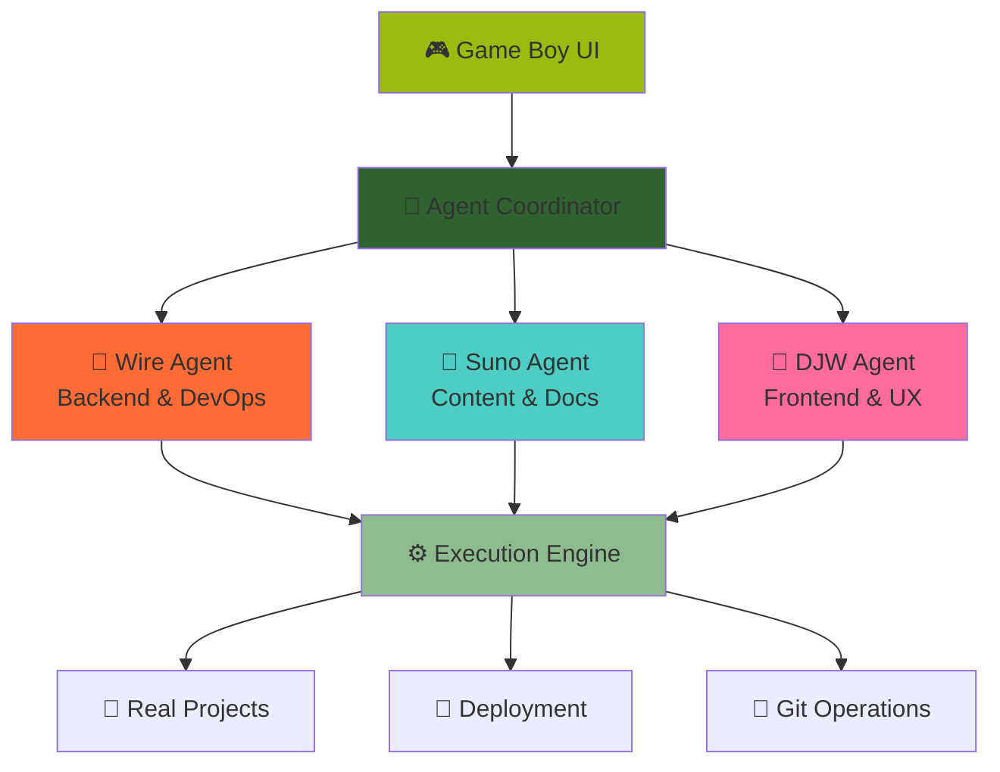

<div align="center">

# 🎮 LLMON: DevVerse Reality Engine

**Where you don't just code — you command ecosystems.**

*A next-generation developer operating system powered by LLM agents, wrapped in a retro Game Boy interface that masks deep engineering power.*

[](https://github.com/yourusername/llmon-devverse/stargazers)
[](LICENSE)
[](https://nodejs.org)
[](https://hub.docker.com/r/llmon/devverse)

---

## 🚀 One-Click Deploy

### ☁️ Cloud Platforms

[](https://vercel.com/new/clone?repository-url=https://github.com/yourusername/llmon-devverse&env=GEMINI_API_KEY&envDescription=Get%20your%20Gemini%20API%20key%20from%20Google%20AI%20Studio&envLink=https://makersuite.google.com/app/apikey)
[](https://railway.app/template/LLMON-DevVerse?referralCode=scout)
[](https://heroku.com/deploy?template=https://github.com/yourusername/llmon-devverse)

### 💻 Development Environments

[](https://codespaces.new/yourusername/llmon-devverse?quickstart=1)
[](https://gitpod.io/#https://github.com/yourusername/llmon-devverse)
[](https://repl.it/github/yourusername/llmon-devverse)

### 🐳 Container Deployment

```bash
docker run -p 3000:3000 -e GEMINI_API_KEY=your-key llmon/devverse:latest
```

[](https://hub.docker.com/r/llmon/devverse)
[](https://hub.docker.com/r/llmon/devverse)

### 🖥️ Desktop Applications

| Platform | Download | Size |
|----------|----------|------|
| Windows | [Download .exe](https://github.com/yourusername/llmon-devverse/releases/latest/download/LLMON-DevVerse-Setup.exe) | ~120MB |
| macOS | [Download .dmg](https://github.com/yourusername/llmon-devverse/releases/latest/download/LLMON-DevVerse.dmg) | ~125MB |
| Linux | [Download .AppImage](https://github.com/yourusername/llmon-devverse/releases/latest/download/LLMON-DevVerse.AppImage) | ~130MB |

---

</div>

## 🎯 What is LLMON?

LLMON transforms development into a **retro gaming experience** while delivering **professional-grade results**. Command three specialized AI agents through an authentic Game Boy interface to build complete applications with natural language.

### ✨ **The Magic**
- 🗣️ **Natural Language Programming**: Describe what you want, get working code
- 🤖 **Three AI Agents**: Wire (Backend), Suno (Content), DJwrighTalker (Frontend)
- 🎮 **Game Boy Interface**: Pixel-perfect retro UI with authentic sound effects
- ⚡ **Real Execution**: Actually builds and deploys working applications
- 🚀 **Zero Setup**: Works in browser, desktop, or container

### 📹 **See It In Action**

> 🎬 *[Demo Video Coming Soon]*

```
🎮 Mission: "Build a React todo app with FastAPI backend"

🔌 Wire: "Wiring up FastAPI server with SQLite database..."
📝 Suno: "Crafting API documentation and user guides..."
🎨 DJW: "Designing responsive React components..."

⚡ Result: Complete full-stack application in minutes!
```

<div align="center">

## 🧠 Architecture



</div>

## ✨ Features

<div align="center">

| 🎮 **Game Boy Experience** | 🤖 **AI Agent Team** | ⚡ **Real Development** |
|:--:|:--:|:--:|
| Pixel-perfect retro UI | Wire: Backend & DevOps | Actual file operations |
| Authentic sound effects | Suno: Content & Docs | Real git integration |
| D-pad navigation | DJW: Frontend & UX | Live code execution |
| Mission Control interface | Powered by Gemini 2.0 | Project scaffolding |

</div>

### 🚀 **What Makes LLMON Special**

#### 🗣️ **Natural Language Programming**
```
You: "Create a React chat app with real-time messaging"
LLMON: *Builds complete WebSocket chat with React frontend*
```

#### 🤖 **Specialized AI Agents**
- **🔌 Wire**: Architects backends, configures servers, handles DevOps
- **📝 Suno**: Writes documentation, processes content, creates guides  
- **🎨 DJwrighTalker**: Designs UIs, builds components, optimizes UX

#### ⚡ **Real Execution Power**
- **Not a simulator** - actually builds working applications
- **Live file editing** - modifies real project files
- **Package management** - runs npm, pip, bun commands
- **Server deployment** - starts actual development servers
- **Git operations** - real commits, branches, version control

#### 🎮 **Retro Gaming Interface**
- **Authentic Game Boy aesthetics** with pixel-perfect styling
- **Sound effects** - navigation beeps, success fanfares, error alerts
- **Tactile controls** - D-pad navigation, A/B button interactions
- **Real-time feedback** - agent status indicators, progress animations

## 🚀 Quick Start

### 🎯 **Choose Your Adventure**

<div align="center">

| Method | Time | Best For |
|--------|------|----------|
| **☁️ Cloud Deploy** | 30 seconds | Instant demo |
| **💻 GitHub Codespaces** | 1 minute | Cloud development |
| **🐳 Docker** | 2 minutes | Production setup |
| **🖥️ Desktop App** | 1 download | Offline use |
| **📱 Local Development** | 5 minutes | Full control |

</div>

### ☁️ **Instant Cloud Deploy** *(30 seconds)*

1. Click any deploy button above ⬆️
2. Add your [Gemini API key](https://makersuite.google.com/app/apikey) 
3. Launch your LLMON DevVerse! 🚀

### 💻 **GitHub Codespaces** *(1 minute)*

1. Click "Open in GitHub Codespaces" above
2. Wait for environment to load
3. Add `GEMINI_API_KEY` to terminal:
   ```bash
   export GEMINI_API_KEY="your-key-here"
   npm start
   ```
4. Open the forwarded port (3000)

### 🐳 **Docker** *(2 minutes)*

```bash
# One command setup
docker run -p 3000:3000 -e GEMINI_API_KEY=your-key llmon/devverse:latest

# Or with docker-compose
git clone https://github.com/yourusername/llmon-devverse
cd llmon-devverse
echo "GEMINI_API_KEY=your-key" > .env
docker-compose up -d
```

### 📱 **Local Development** *(5 minutes)*

```bash
# Clone and setup
git clone https://github.com/yourusername/llmon-devverse
cd llmon-devverse
npm install

# Configure environment
cp .env.example .env
# Edit .env and add your Gemini API key

# Launch LLMON
npm start
# Open http://localhost:3000
```

### 🔑 **Get Your Gemini API Key**

1. Visit [Google AI Studio](https://makersuite.google.com/app/apikey)
2. Create a new API key
3. Copy and use in your deployment

## 🎯 First Mission

### 🚀 **Your First Build** *(2 minutes)*

<div align="center">

**1. Navigate to Mission Control** 🎯  
**2. Enter your mission** 🗣️  
**3. Watch agents collaborate** 🤖  
**4. Get working application** ⚡  

</div>

#### Example Mission:
```
"Build a React todo app with a FastAPI backend"
```

#### What Happens:
```
🔌 Wire: "Wiring up FastAPI server with SQLite database..."
    → Creates server.py, database models, API endpoints
    → Sets up CORS, validation, authentication

📝 Suno: "Crafting API documentation and README..."
    → Generates OpenAPI specs, usage examples
    → Creates comprehensive documentation

🎨 DJW: "Designing responsive React interface..."
    → Builds components, styling, state management
    → Implements CRUD operations, loading states

⚡ Execution Engine:
    → npm create react-app todo-app
    → pip install fastapi uvicorn sqlalchemy
    → npm start & uvicorn main:app --reload
```

#### Result:
✅ **Complete full-stack application**  
✅ **Frontend running on localhost:3000**  
✅ **Backend API on localhost:8000**  
✅ **Database with sample data**  
✅ **Documentation and deployment guides**  

### 💬 **Direct Agent Communication**

Talk to agents directly via the terminal:

```bash
# Talk to Wire (Backend)
agent wire "Setup a GraphQL API with authentication"

# Talk to Suno (Content)
agent suno "Write API documentation with examples"

# Talk to DJwrighTalker (Frontend)
agent djw "Create a dashboard with dark mode toggle"
```

## 🎮 Game Boy Controls

<div align="center">


| Physical | Keyboard | Action |
|:--------:|:--------:|--------|
| D-Pad ↑↓←→ | Arrow Keys | Navigate menus |
| A Button | Enter | Select/Confirm |
| B Button | Escape | Back/Cancel |
| Start | Tab | Main menu |
| Select | Space | Context actions |

</div>

### 🎵 **Authentic Sound Effects**
- 🔊 Navigation beeps and clicks
- 🎉 Success fanfares and mission completion
- ⚠️ Error alerts and warnings
- 🎵 Boot sequence and power-on sounds
- 🔇 Toggle sound on/off anytime

### ⚡ **Keyboard Shortcuts**

| Shortcut | Action |
|----------|--------|
| `Ctrl+M` | Mission Control |
| `Ctrl+P` | Projects |
| `Ctrl+A` | Agents |
| `Ctrl+T` | Terminal |
| `Ctrl+S` | Toggle Sound |
| `Ctrl+Enter` | Launch Mission |

## 🤖 Meet Your AI Team

<div align="center">

### The LLMON Agent Squad

</div>

<table>
<tr>
<td width="33%" align="center">

### 🔌 **Wire**
*Backend Sorcerer*

**Specialties:**
- 🏗️ API Architecture
- 🗄️ Database Design  
- 🐳 Docker & DevOps
- 🔒 Security Implementation
- ☁️ Cloud Deployment
- 🔄 CI/CD Pipelines

**Personality:**  
*"Let me wire up some solid infrastructure for you."*

**Power Level:** ⚡⚡⚡⚡⚡ 85%

</td>
<td width="33%" align="center">

### 📝 **Suno**
*Content Alchemist*

**Specialties:**
- 📖 Technical Documentation
- ✍️ Creative Writing
- 🎵 Lyrics & Poetry
- 🌐 Multi-language Content
- 🔍 SEO Optimization
- 📊 Data Processing

**Personality:**  
*"Weaving words into reality, one story at a time."*

**Power Level:** ⚡⚡⚡⚡ 78%

</td>
<td width="33%" align="center">

### 🎨 **DJwrighTalker**
*Design Virtuoso*

**Specialties:**
- ⚛️ React/Vue Development
- 🎨 UI/UX Design
- 📱 Responsive Layouts
- ✨ Animations & Interactions
- ♿ Accessibility Standards
- 🚀 Performance Optimization

**Personality:**  
*"Creating pixel-perfect experiences that users love."*

**Power Level:** ⚡⚡⚡⚡⚡ 92%

</td>
</tr>
</table>

### 🧠 **Powered by Gemini 2.0**

All agents run on Google's latest **Gemini 2.0 Flash** model, providing:
- 🔄 Real-time collaboration between agents
- 🎯 Context-aware task delegation
- 🧠 Memory of previous interactions
- 📈 Continuous learning and improvement

## 📁 Project Templates

<div align="center">

| Template | Stack | Features | Build Time |
|----------|-------|----------|------------|
| 🌐 **Web App** | React + Vite + TypeScript | Components, routing, styling | ~2 min |
| 🔌 **API Server** | FastAPI/Express + Database | REST endpoints, auth, validation | ~3 min |
| 🚀 **Full-Stack** | React + FastAPI + SQLite | Complete CRUD app with frontend | ~5 min |
| 🐍 **Python Project** | Python + Poetry | Data science, ML, automation | ~2 min |
| 📦 **Node.js App** | Node + TypeScript | CLI tools, servers, utilities | ~2 min |
| 🎮 **Game** | HTML5 Canvas + JavaScript | Browser games with physics | ~4 min |
| 📱 **Mobile-Ready** | React + PWA | Responsive, installable web app | ~3 min |

</div>

### 🎯 **Smart Project Scaffolding**

LLMON doesn't just create empty templates - it builds **production-ready** projects:

✅ **Best practices** - ESLint, Prettier, TypeScript configs  
✅ **Testing setup** - Jest, testing utilities, example tests  
✅ **Build tools** - Optimized Vite/Webpack configurations  
✅ **Documentation** - README, API docs, deployment guides  
✅ **Git integration** - Initial commit, .gitignore, branch setup  
✅ **Environment configs** - Development, staging, production  
✅ **Security** - CORS, validation, sanitization, auth scaffolding  

## ⚙️ Configuration

<details>
<summary><strong>🔧 Environment Variables</strong></summary>

### Required
```bash
GEMINI_API_KEY=your-gemini-api-key  # Get from Google AI Studio
```

### Optional
```bash
# Server Configuration
PORT=3000
NODE_ENV=production
PROJECT_DIR=./projects

# Agent Configuration
WIRE_MODEL=gemini-2.0-flash-exp
SUNO_MODEL=gemini-2.0-flash-exp
DJW_MODEL=gemini-2.0-flash-exp

# Features
ENABLE_SOUND_EFFECTS=true
ENABLE_AUTO_SAVE=true
ENABLE_GIT_INTEGRATION=true

# Security (Production)
SECURE_COOKIES=true
SESSION_SECRET=your-random-secret
RATE_LIMIT_ENABLED=true
CORS_ORIGIN=https://your-domain.com
```

</details>

<details>
<summary><strong>🤖 Agent Customization</strong></summary>

### Adding New Agents

1. Create agent file in `server/agents/`:
```javascript
export class CustomAgent {
  constructor(genAI) {
    this.displayName = "CustomAgent";
    this.skills = ["Specialized Skill"];
    this.model = genAI.getGenerativeModel({ model: "gemini-2.0-flash-exp" });
  }
  
  async processTask(task, projectId) {
    // Agent logic here
  }
}
```

2. Register in `AgentCoordinator.js`:
```javascript
import { CustomAgent } from '../agents/CustomAgent.js';

this.agents = {
  wire: new WireAgent(this.genAI),
  suno: new SunoAgent(this.genAI),
  djw: new DJWAgent(this.genAI),
  custom: new CustomAgent(this.genAI)  // Add here
};
```

3. Update Game Boy UI with new agent representation

### Personality Customization

Modify agent personalities in their respective files:
- `server/agents/WireAgent.js` - Backend specialist
- `server/agents/SunoAgent.js` - Content creator
- `server/agents/DJWAgent.js` - Frontend designer

</details>

## 🛠️ Development & Extending LLMON

<details>
<summary><strong>🔧 Development Setup</strong></summary>

### Prerequisites
- Node.js 18+
- Git
- Gemini API key

### Development Install
```bash
git clone https://github.com/yourusername/llmon-devverse
cd llmon-devverse
npm install
cp .env.example .env
# Add your GEMINI_API_KEY to .env
npm run dev
```

### Development Scripts
```bash
npm run dev          # Start development server
npm run test         # Run tests
npm run build        # Build all platforms
npm run build:electron # Build desktop apps
npm run build:docker   # Build Docker image
npm run lint         # Check code quality
```

</details>

<details>
<summary><strong>🔌 Plugin System</strong></summary>

### Creating Plugins

LLMON supports plugins for extending functionality:

```javascript
// plugins/my-plugin.js
export class MyPlugin {
  constructor() {
    this.name = 'My Plugin';
    this.version = '1.0.0';
  }
  
  async onProjectCreate(project) {
    // Hook into project creation
  }
  
  async onAgentResponse(agent, response) {
    // Process agent responses
  }
}
```

### Integration Examples
- **Cloud storage** - Auto-sync projects to Google Drive
- **Team collaboration** - Real-time multi-user editing
- **Custom agents** - Specialized domain agents (ML, blockchain)
- **External APIs** - Integration with GitHub, Jira, Slack

</details>

<details>
<summary><strong>🎨 Theming & UI Customization</strong></summary>

### Custom Themes

Create custom Game Boy themes:

```css
/* themes/cyberpunk.css */
:root {
  --gameboy-bg: #0f0f0f;
  --screen-bg: #00ff41;
  --pixel-green: #000000;
  --button-red: #ff0080;
  --button-blue: #0080ff;
}
```

### Sound Packs

Replace Game Boy sounds with custom audio:

```javascript
// sounds/retro-pack.js
export const soundPack = {
  nav: 'sounds/nav.wav',
  select: 'sounds/select.wav',
  boot: 'sounds/boot.wav'
};
```

</details>

## 🎵 Immersive Audio Experience

<div align="center">

**🔊 Authentic Game Boy Sound Effects**

*Powered by Web Audio API for pixel-perfect audio nostalgia*

</div>

| Sound | Trigger | Description |
|-------|---------|-------------|
| 🔊 **Navigation** | D-pad movement | Soft directional beeps |
| ✅ **Confirmation** | A button press | Satisfying selection chime |
| ❌ **Cancel** | B button press | Quick dismissal tone |
| 🚀 **Mission Launch** | Starting projects | Epic fanfare sequence |
| ⚡ **Success** | Task completion | Triumphant success jingle |
| ⚠️ **Error** | System errors | Helpful alert tone |
| 🎵 **Boot Sequence** | System startup | Classic power-on melody |
| 💤 **Sleep Mode** | Idle state | Gentle ambient hum |

### 🎛️ **Audio Controls**
- 🔇 **Mute/Unmute**: Toggle sound effects anytime
- 🔉 **Volume Control**: Adjust audio levels
- 🎚️ **Sound Packs**: Switch between different audio themes
- 🎧 **Headphone Mode**: Enhanced audio for immersive development

## 🌟 Advanced Features

<div align="center">

### 🚀 **Enterprise-Grade Capabilities**

</div>

<table>
<tr>
<td width="50%">

#### 🤖 **Multi-Agent Orchestration**
- **Parallel Processing**: Agents work simultaneously
- **Smart Delegation**: Tasks routed to optimal agents
- **Conflict Resolution**: Automatic merge conflict handling
- **Load Balancing**: Distribute work across agent capacity

#### 🧠 **Advanced AI Memory**
- **Session Persistence**: Remember project context
- **Learning System**: Improve from past interactions
- **Context Awareness**: Understand project relationships
- **Pattern Recognition**: Identify recurring workflows

</td>
<td width="50%">

#### 🔄 **Real-Time Collaboration**
- **Live Updates**: WebSocket-powered real-time sync
- **Multi-User Support**: Team development workflows
- **Shared State**: Synchronized project state
- **Activity Streams**: Track all team changes

#### 🔌 **Extensibility & Integration**
- **Plugin Architecture**: Custom agent development
- **API Integrations**: GitHub, Jira, Slack, Discord
- **Webhook Support**: External service notifications
- **Custom Templates**: Organization-specific scaffolding

</td>
</tr>
</table>

### 📊 **Analytics & Monitoring**

- 📈 **Project Metrics**: Build times, success rates, agent utilization
- 🔍 **Code Quality**: Automated testing, linting, security scans
- 📋 **Audit Trails**: Complete history of all operations
- 🎯 **Performance Insights**: Optimize development workflows

## 🚀 Deployment Ecosystem

<div align="center">

### **Deploy Anywhere, Run Everywhere**

</div>

<table>
<tr>
<td width="25%" align="center">

#### 🖥️ **Desktop**


- Native Windows/Mac/Linux
- Offline development
- Auto-updater
- System integration

</td>
<td width="25%" align="center">

#### ☁️ **Cloud**


- Vercel, Railway, Heroku
- Auto-scaling
- Global CDN
- Zero maintenance

</td>
<td width="25%" align="center">

#### 🐳 **Container**


- Kubernetes ready
- Multi-environment
- CI/CD integration
- Enterprise scaling

</td>
<td width="25%" align="center">

#### 📱 **Mobile**


- PWA support
- Touch optimized
- Termux compatible
- Responsive design

</td>
</tr>
</table>

### 🔧 **Deployment Features**

- ✅ **One-click deploy** to 10+ platforms
- ✅ **Auto-SSL** certificates and HTTPS
- ✅ **Environment isolation** for dev/staging/prod
- ✅ **Health monitoring** and auto-recovery
- ✅ **Load balancing** and horizontal scaling
- ✅ **Backup and restore** capabilities
- ✅ **Blue-green deployments** for zero downtime
- ✅ **Multi-region** deployment support

## 🤝 Contributing

<div align="center">

**Join the LLMON DevVerse Community!**

[](https://github.com/yourusername/llmon-devverse/graphs/contributors)
[](https://github.com/yourusername/llmon-devverse/issues)
[](https://github.com/yourusername/llmon-devverse/pulls)

</div>

### 🚀 **Ways to Contribute**

| Area | How to Help | Skill Level |
|------|-------------|-------------|
| 🤖 **Agent Development** | Create specialized agents | Intermediate |
| 🎮 **Game Boy UI** | Enhance retro interface | Beginner |
| 🔌 **Integrations** | Connect external services | Intermediate |
| 📖 **Documentation** | Improve guides and tutorials | Beginner |
| 🐛 **Bug Fixes** | Solve issues and improve stability | Any |
| 🌐 **Translations** | Localize LLMON for global use | Beginner |
| 🎨 **Themes** | Design custom Game Boy themes | Beginner |
| 🧪 **Testing** | Write tests and improve coverage | Intermediate |

### 📋 **Quick Start Guide**

```bash
# 1. Fork & Clone
git clone https://github.com/yourusername/llmon-devverse
cd llmon-devverse

# 2. Install & Setup
npm install
cp .env.example .env
# Add your GEMINI_API_KEY

# 3. Create Feature Branch
git checkout -b feature/amazing-feature

# 4. Make Changes & Test
npm run dev
npm test

# 5. Commit & Push
git commit -m "✨ Add amazing feature"
git push origin feature/amazing-feature

# 6. Open Pull Request
```

### 🎯 **Contribution Guidelines**

- ✅ **Follow the code style** - We use ESLint and Prettier
- ✅ **Write tests** - Maintain >80% code coverage
- ✅ **Update documentation** - Keep README and docs current
- ✅ **Use conventional commits** - Follow semantic commit messages
- ✅ **Test thoroughly** - Verify on multiple platforms
- ✅ **Be respectful** - Follow our Code of Conduct

### 🏆 **Recognition**

All contributors get:
- 🎖️ **Listed in contributors** - Your GitHub profile featured
- 🎮 **Special Game Boy avatar** - Custom pixel art recognition
- 🚀 **Early access** - Preview new features first
- 💌 **LLMON swag** - Stickers and merchandise

### 💬 **Community**

- 💬 **Discord**: [Join our server](https://discord.gg/llmon)
- 🐦 **Twitter**: [@LLMONDevVerse](https://twitter.com/LLMONDevVerse)
- 📧 **Email**: contribute@llmon.dev
- 📋 **Discussions**: [GitHub Discussions](https://github.com/yourusername/llmon-devverse/discussions)

## 📊 **Project Stats**

<div align="center">

[](https://github.com/yourusername/llmon-devverse/releases)
[](https://github.com/yourusername/llmon-devverse/releases)
[](https://hub.docker.com/r/llmon/devverse)
[](https://github.com/yourusername/llmon-devverse/stargazers)

</div>

---

## 📄 License

This project is licensed under the **MIT License** - see the [LICENSE](LICENSE) file for details.

## 🎮 Credits & Acknowledgments

### 🎨 **Inspiration**
- **🎮 Nintendo Game Boy** - The iconic design that started it all
- **🤖 Modern AI Agents** - Standing on the shoulders of giants
- **👨‍💻 Developer Community** - For continuous feedback and support

### 🔋 **Powered By**
- **🧠 Google Gemini 2.0** - Advanced AI capabilities
- **⚛️ React + Node.js** - Modern web technology stack
- **🐳 Docker** - Containerization and deployment
- **🎵 Web Audio API** - Authentic retro sound effects

### 🏆 **Special Thanks**
- **Scout AI Team** - For the vision and execution
- **Beta Testers** - Early adopters who shaped the experience
- **Open Source Community** - For the tools and libraries
- **Retro Gaming Enthusiasts** - For keeping the magic alive

---

<div align="center">

## 🚀 **Ready to Build the Future?**

**Click any deploy button above and start your LLMON journey!**

---

### **Built with ❤️ by Scout AI**

**🎮 LLMON DevVerse Reality Engine v1.0**  
*Where retro gaming meets next-generation development*

[](https://scout.new)
[](LICENSE)
[](https://github.com/yourusername/llmon-devverse)

---

**Star ⭐ this repo if LLMON helped you build something amazing!**

</div>